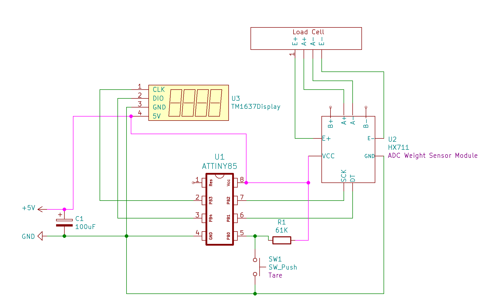

# Ender3-Filament-Digital-Scale
This project is to add a load cell to the filament spool holder of a Creality Ender 3 Pro 3D-printer to measure and display weight of spool.  Using the tare function of the scale on an empty spool, the user can determine the amount of filament (in grams) remaining on a spool.

This project uses an Arduino or ATtiny85 microcontroller with the HX711 load cell module for weight measurement and a TM1637 4-digit LED display. 

## Components
    ATiny85 Microcontroller
    TM1636 4 Digit 7-Segement LED Display 
    Load Cell
    HX711 Load Cell Amplifier (ADC)
    100uF Electrolytic Capacitor
    5V Power Supply

## Schematic

## How to Build

### Print Mount and Display Box
The filament scale mounts on top of the Ender 3 top rail where the filament spool is located.  You will need to print the load cell mount and the LED display box. This is available on [Thingiverse](https://www.thingiverse.com/thing:4545434) or [Tinkercad](https://www.tinkercad.com/things/9OpwKBmKX0j-ender3-loadcell-filament-scale-mount).

See example build pictures below.

## Setup

### Calibration
This sketch requires that you calibrate the load cell.  This involves the following steps:
1. Run the sketch with DEBUG true (using a Arduino Uno or other microcontroller with serial)
2. Record the "HX711 reading" values with NO load on the scale - this is your "`CAL_OFFSET`"
3. Use an trusted scale and weigh an object (grams or kg) - record this value as your "`KNOWN-VALUE`"
4. Place the object on the load cell and record the "HX711 reading" - this is "`CAL_VALUE`"
5. Compute the `CAL_RATIO` = (`CAL_VALUE` - `CAL_OFFSET`) / `KNOWN-VALUE`
6. Edit the #defines below for `CAL_RATIO` and `CAL_OFFSET`

### Programming Notes
The TARE button uses PB0. If you use the Tiny AVR Programmer from Sparkfun
it drives an LED on PB0 and once the sketch is uploaded, the TTiny will read PB0 as LOW and assume you wish to TARE the scale. You will need to remove the the chip from the programmer after uploading to get it to work correctly in the circuit.

This code uses the [TM1637TinyDisplay](https://github.com/jasonacox/TM1637TinyDisplay) and [HX711](https://github.com/bogde/HX711) Arduino libraries that can be installed via the Arduino IDE. 

### Function
On start the circuit will read the last TARE value from EEPROM and display the the current weight. Press and hold the TARE button and the current weight value will be recorded in EEPROM and subtracted from the current reading to "Zero" out the scale.

## Build Pictures

## References
* Library for HX711 https://github.com/bogde/HX711
* HX711 Load Cell Amplifier, Weighing Scale Design https://circuits4you.com/2016/11/25/hx711-arduino-load-cell/